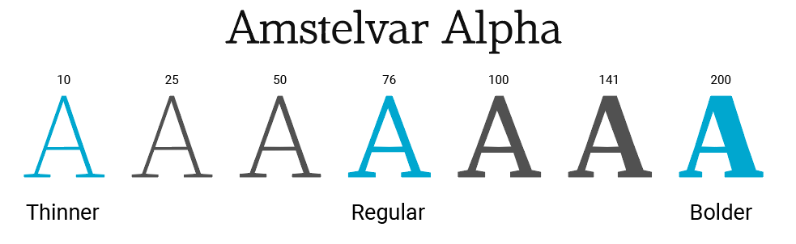

# 가변 폰트

가변 폰트는 `width`(너비), `weight`(두께), `slant`(기울기) 등 폰트 별로 다양한 축을 가지고 있으며 이 축을 수치로 조정하여 원하는 스타일을 지정하고 조합할 수 있습니다.

대표적인 가변폰트인 Amstelvar는 width, weight, optical size 의 총 3개의 축을 가지고 있으며 아래와 같이 weight 축을 조정하여 총 200개의 폰트 스타일을 지정할 수 있습니다.

 
 
 

## 가변(variable)폰트와 기존(static) 정적 폰트의 비교
---
 

 기존 폰트는 각각의 폰트가 width, weight, style 등이 조합되어 만들어졌습니다. 
 그래서 다음과 같이 파일명이 다른 별도의 파일들을 사용했습니다.
 - `${name}`
 - `${name}-Bold`
 - `${name}-Bold-Italic`

기존의 폰트는 다양하게 사용하려면 더 많은 파일을 추가해야 했습니다.

반면, 가변 폰트의 경우에는 모든 스타일의 조합이 단일 파일에 통합됩니다. 별도로 로드한 몇가지 형태로 제한되지 않고 width, weight, style에 접근할 수 있게 됩니다. <strong>`(이런 형태는 단일 글꼴보다 크기가 크지만 여러 단일 폰트를 합친 파일 크기보다 작거나 거의 같습니다. -> 폰트 요청 횟수가 줄어서 성능 향상에 도움이 됩니다.)`</strong>

 
 
 

## References
---
- https://developer.mozilla.org/en-US/docs/Web/CSS/CSS_Fonts/Variable_Fonts_Guide
- https://developer.mozilla.org/en-US/docs/Web/CSS/@font-face/font-variation-settings
- https://developer.mozilla.org/en-US/docs/Web/CSS/font-variation-settings
- https://developers.google.com/web/fundamentals/design-and-ux/typography/variable-fonts/
- https://developer.microsoft.com/en-us/microsoft-edge/testdrive/demos/variable-fonts/
- https://drafts.csswg.org/css-fonts-4/#low-level-font-variation-settings-control-the-font-variation-settings-property
- https://caniuse.com/#feat=variable-fonts
- https://www.etc.supply/animating-a-variable-font-with-css/